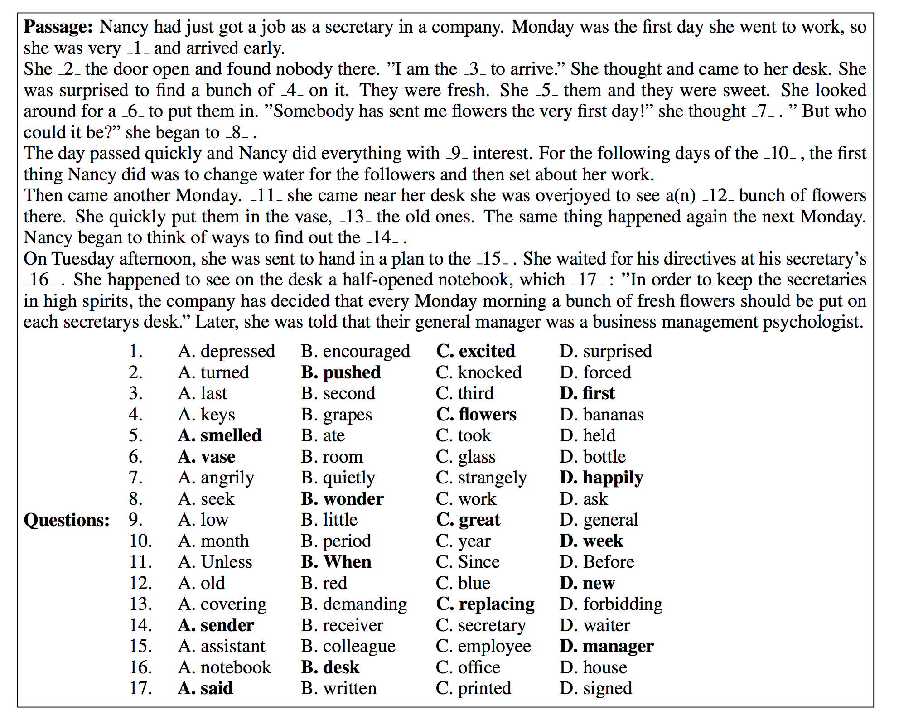

# Large-scale Cloze Test Dataset Designed by Teachers

Code for the paper:

[Large-scale Cloze Test Dataset Designed by Teachers](https://arxiv.org/pdf/1711.03225.pdf). Qizhe Xie*, Guokun Lai*, Zihang Dai and Eduard Hovy.

## An example problem:

* Correct answers are highlighted

## Dependencies
* Python 2.7
* latest Pytorch

## Usage
* tar xzvf data.tar.gz
* test the best model: bash test.sh
* replace embed/glove.6B.300d.txt with the corresponding file in http://nlp.stanford.edu/data/glove.6B.zip
* training the best model: bash train.sh

## Acknowledgement
* The code is adapted from OpenNMT (https://github.com/OpenNMT/OpenNMT-py) and Pytorch language model example (https://github.com/pytorch/examples/tree/master/word_language_model)
* The code to highlight informative words (Figure 1 in the paper) is available at https://gist.github.com/ihsgnef/f13c35cd46624c8f458a4d23589ac768

## Contact
* Please contact Qizhe Xie (qizhex AT cs cmu edu) if you have questions

## License
MIT
